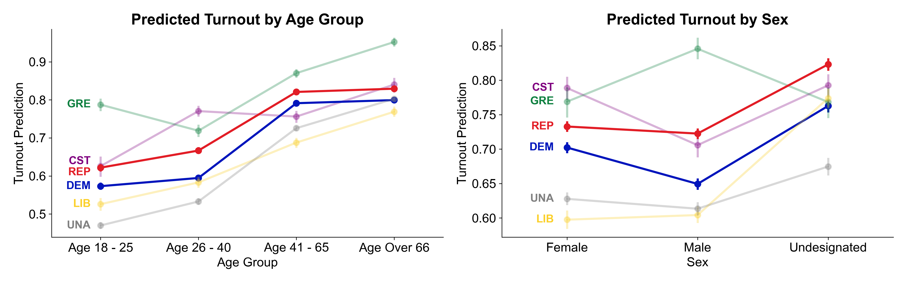

```{r setup, include=FALSE}
knitr::opts_chunk$set(
	echo = FALSE,
	message = FALSE,
	warning = FALSE
)

library(ggplot2)
library(dplyr)
library(tidyr)
library(data.table)
library(lmerTest)
library(GGally)
library(knitr)
library(xtable)
library(kableExtra)
library(stargazer)
library(purrr)
library(arm)
library(lattice)
library(lme4)
```

# Part I: StreetRx
## Summary
This study explores factors associated with the prices of methadone on the black market with a multilevel linear regression model. The response variable in our study is the price per milligram (`ppm`) variable.  In combination, the linear regression models and the stepwise regression process suggested that `mgstr`, `source`, and `bulk_purchase` as predictor variables. `USA_regions` and `state` are suitable as hierarchical predictor variables. Our final model contains `mgstr`, `source`, and `bulk_purchase` as fixed effects, and  `USA_regions` and `state` as random intercept variables. The fixed effects suggested that there is a tendency for lower prices with higher dosage strength as well as with bulk purchase. The hierarchical variables suggested that methadone prices could vary by region within the United States. For example, the price per milligram (`ppm`) in the South tends to be higher than in other regions. There are three significant states: California, Arizona, and Tennessee, in which California and Arizona seem to have the cheapest methadone prices, while Tennessee is paying significantly more compared to all the other states. 

## Introduction
Prescription opioid diversion and misuse are major public health issues. Street pricing reflects medication availability, demand, and potential abuse. However, such information can be challenging to obtain, and in an age of Internet-based social networks, crowdsourcing seems to be an effective solution. Nevertheless, for our study, we use data provided by StreetRx. StreetRx is a web-based citizen reporting tool that collects real-time street price data on diverted pharmaceutical medicines. Based on crowdsourcing ideas for public health surveillance, users can anonymously report drug prices they paid or heard were paid for diverted prescription drugs on the website. This study utilizes the product- and geographically-specific data on the drug Methadone from StreetRx. Methadone is an opioid class medication that helps to reduce drug withdrawal symptoms for other narcotic drugs. Unfortunately, methadone itself is also addictive. Knowing the price of methadone on the street would be crucial to preventing drug abuse, misuse, and the diversion of prescription drugs. Thus, this study focuses on exploring factors that influence the price of methadone per milligram. We aim to utilize a multilevel model to study characteristics associated with the price per mg of methadone, allowing for potential clustering by area and examining variability in pricing by region. 

## Data
The data set used for the analysis is the subset with methadone as an active ingredient. It contains 13 variables, out of which we are interested in six. Price per milligram (`ppm`) is our response variable, `source`, `mgstr`, `bulk_purchase` are our predictor variables, and `state` and `USA_region` are candidates for hierarchical levels. We removed the variable `form_temp` because Methadone is only available in pill form in the data set. In addition, the data set contains missing values in two variables of interest,`mgstr` and `ppm`, which is outcome variable. Therefore, the exploratory data analysis begins with data cleaning in eliminating missing data values from the data set.

```{r, echo=FALSE}
load("../Data/streetrx.RData")
df = streetrx[streetrx$api_temp == "methadone",]
vars_to_remove = c("yq_pdate", "price_date", "city", "Primary_Reason", "country", "api_temp", "form_temp")
for (var in vars_to_remove){
  df[var] = NULL
}
df$fac_mgstr = as.factor(df$mgstr)
levels(df$bulk_purchase) = c("Not Bulk", "Bulk")
df$source = as.character(df$source)
url_regex = "(http://|\\.)"
df$source[grepl(url_regex, df$source)] = "Internet"
df$source[df$source %in% c("", "N/A", "None")] = "No Input"
df$source[df$source %in% c("google", "Internet Pharmacy", "Poopy,", "Streetrx")] = "Internet"
df$source = as.factor(df$source)
df = drop_na(df, "ppm")
df = drop_na(df, "mgstr")
```

The original factor variable `source` has high cardinality with few cases in certain factor levels. Therefore, we decided to group some levels to have a clearer picture in the exploratory data analysis. All internet-based sources, such as the different URLs, "Internet Pharmacy", and "Google" are grouped into a single level named "Internet", and values such as "None" and "N/A" are grouped into the "No Input" category. Moreover, all entries with missing `ppm` are removed, which also eliminated rows with missing `mgstr` values. The variable `mgstr` has six unique values and numeric data types. After an initial inspection, the `mgstr` variable is transformed to a factor variable, and 1mg, 2.5mg, and 15mg cases are filtered as they have only one or two entries per value, leaving only 5mg, 10mg, and 40mg. Usually Methadone pills come in 5mg or 10mg doses, while the 40mg pills are not FDA-approved and thus only appear on the black market.

\begin{center}\begin{tabular}{lrrrrrr}
\toprule
mgstr & 1 & 2.5 & 5 & 10 & 15 & 40\\
\midrule
count & 2 & 1 & 781 & 3047 & 1 & 351\\
\bottomrule
\end{tabular}

mgstr frequency
\end{center}


```{r, eval = FALSE, echo=FALSE}
mgstrcount = transpose(df %>% count(mgstr))
colnames(mgstrcount) = mgstrcount[1,]
mgstrcount = cbind(data.frame(c("mgstr", "count")), mgstrcount)
colnames(mgstrcount) = NULL
colnames(mgstrcount) = mgstrcount[1,]
mgstrcount = mgstrcount[-1, ] 
rownames(mgstrcount) = NULL
knitr::kable(mgstrcount, format="latex", booktabs=TRUE) %>% 
  kable_styling(latex_options=c("hold_position"))

```

The distribution of the response variable `ppm` is highly right-skewed and contains quite a few outliers. The log transformation of `ppm` helps to reduce the skewness in the distribution. Thus, we would like to examine further the performance of log-transformed `ppm` in the modeling phase. Another potential factor that could influence the final model is the outliers within `ppm`. According to a research article by Surratt et al. (2013), the median price for methadone on the black market is \$1.00 in 2013. Therefore, it is concerning that our data set contains several outliers that are up to 40 times greater than the median street price. Based on this data, we use the percentile method for outliers removal with a 95 percentile level (which works out to a \$2 `ppm`) as a cutoff. Overall, 181 data points were removed from the data set, which corresponds to around 4% of the total data.

```{r, echo=FALSE,out.width="70%", out.height="35%",fig.cap="ppm and ppm by state distributions",fig.show='hold',fig.align='center'}

knitr::include_graphics(c("../Presentation/Images/part1_univariate_ppm.png","../Presentation/Images/part1_ppm_per_state.png"))
``` 

During EDA, we found out (using box plots) that the price per milligram distributions are about the same for different source levels. But, there is a tendency for lower prices with higher dosage strength. Interestingly, different regions have different median prices per methadone milligram. The same situation holds across the states which can be seen in the plot above which shows a subset of all states. Therefore, these variables may be potential candidates for a hierarchical level and as different states contain different number of observations, a hierarchical model may be better choice than multivariate linear regression with `state` and `USA_regions` as categorical variables. Surprisingly, there is not much price difference in `ppm` by `bulk_purchase` variable.  

As for the interaction observed between dosage strength and state, except for Texas and Delaware, the trend of `ppm` by dosage strength remains consistent across states. Similarly, the trend of `ppm` by `source` and `bulk_purchase` also do not appear to vary across states or regions. Therefore, for modeling, we decide to explore varying intercepts as opposed to random slopes.

## Model
To fit the hierarchical linear regression model, we start modeling using a regular linear regression by defining a null model and full model to use in a stepwise regression process in order to build a parsimonious model. The null model contains only an intercept, whereas the full model contains all relevant  non-location variables from the data set without interactions as predictor variables. For the stepwise process, we use the AIC as a decision criterion although using the BIC instead yields similar results. 

Based on the original data (containing all outliers), the resulting model violated the normality assumption. To fix that we tried to log transform the `ppm` variable. Unfortunately, this does not help to meet normality assumption and makes residuals even less normal than before the transformation. Afterwards, we took the original `ppm` variable and removed outliers past the 95th percentile, which helps mitigate severe violation of the normality assumption.  

Our stepwise model turn out to be the full model containing factorized `mgstr`, `source` and `bulk_purchase` as variables. All levels of `mgstr` are significant compared to their respective baselines: "5 mg" as well as "Bulk Purchase" significantly differs from "Not Bulk". Only the "No Input" source level is not significant compared to its baseline, "Heard it". Using this foundational model, we checked potential interactions including: `source`:`fac_mgstr`, `source`:`bulk`, and `fac_mgstr`:`bulk`. In order to do this, we employ the ANOVA F-test to test our original stepwise model against the stepwise model plus interactions separately and find that none of them significantly improve the model performance.  

Given that the data set contains two naturally hierarchical variables `USA_region` and `state` and both of them are promising according to our EDA, we fit three random intercept hierarchical linear regression models including all the variables from the step model. We have the choice of using either `USA_region`, `state`, or both as hierarchical levels. The model using only `USA_region` has a noticeably higher AIC score, whereas `state`-only and the `state` + `USA_region` models have similar AIC scores (the model with both levels having the lowest AIC of 4756.9).

\begin{center}\begin{tabular}{lrrr}
\toprule
& AIC \\
\midrule
region &  4783.7  \\
state     &   4760.2  \\
state and region & 4756.9 \\
\bottomrule
\end{tabular}

Random Intercept Hierarchical models AIC
\end{center}

To choose between these two, we use an ANOVA test. Its result suggests that the model using both `state` and `USA_region` is significantly better than the model that only models random intercepts by `state`. Note that the absolute AIC values between tables differ slightly due to ML/REML refitting. 


```{r echo=FALSE, results='asis'}
# Preprocessing

df = df %>% filter(mgstr %in% c(5, 10, 40))
percentile_cuttoff = quantile(df$ppm, 0.95)
df = df %>% filter(ppm <= percentile_cuttoff)

# Hierarchical models
state_only <- lmer(ppm ~ fac_mgstr + bulk_purchase + source + (1 | state), data = df)
state_and_region <- lmer(ppm ~ fac_mgstr + bulk_purchase + source + (1 | USA_region) + (1 | state), data = df)
ftest = anova(state_only, state_and_region)

cat("\\begin{center}")
xtable(ftest)
cat("\nF-Test for one random intercept vs two random intercepts models\n")
cat("\\end{center}")
```

Following the results of the ANOVA test, our final model contains `mgstr`, `source`, `bulk_purchase` and two hierarchical variables `state`, `USA_region`.

$$ {\rm ppm}_i = (\beta_{0} + \gamma_{0j} + \psi_{0k}) +\sum_{m=2}^3 \beta_{1m}\cdot \mathbb{I}[{\rm mgstr}_{ijk} = m] + \beta_2\cdot{\rm bulk\_purchase}_{ijk}+ \sum_{m=2}^4 \beta_{3m}\cdot \mathbb{I}[{\rm source}_{ijk} = m] + \varepsilon_{ijk} \\$$
$$ \varepsilon_{ijk} \sim \mathcal{N}(0, \sigma^2), i=1, ..., n; j=1,...,J;k=1,...,K $$
$$ \gamma_{0j} \sim \mathcal{N}(0, \tau_{0}^2), i=1, ..., n; j=1,...,J $$
$$ \psi_{0k} \sim \mathcal{N}(0, \varsigma_{0}^2), i=1, ..., n; k=1,...,K $$


As mentioned before, our final model satisfies all linear regression assumptions. However, we acknowledge the fitted versus residuals plot has weird artifacts. This is most likely due to the fact that the data set contains only categorical variables.

```{r, eval=FALSE, echo=FALSE,out.width="33%", out.height="30%",fig.cap="Model assessment plots",fig.show='hold'}

knitr::include_graphics(c("../Presentation/Images/lm_qqplot_residuals.png","../Presentation/Images/lm_resid_fitted.png", "../Presentation/Images/lm_cooks(in r).png"))
``` 

```{r echo=FALSE}
summary_final = summary(state_and_region)
summaryprint = data.frame(summary_final$coefficients)
summaryprint$df = NULL
confdf = confint(state_and_region)
confdf = confdf[4:length(confdf[,1]),]
summarydf = cbind(round(summaryprint,4),round(confdf,4)) #,starsdf))

colnames(summarydf) = c("Estimate","Std. Error","t value", "p value","Lower Bound","Upper Bound")
knitr::kable(summarydf, format="latex", booktabs=TRUE, caption="Fixed effects of the hierarchical linear regression model") %>% 
  kable_styling(latex_options=c("hold_position"))
```

All the fixed effects in the final model are significant. The only exception is the "No Input" category of the `source` variable in comparison to its baseline "Heard it". As all fixed effects coefficients are negative, we can conclude that the highest price is predicted when all fixed effects are at their respective baseline levels, which represents a 5mg dose not purchased in bulk and the source of which has been reported as "Heard It".

As the final model contains many variables, it is easier to understand the model with a prediction plot which incorporates all the variables except `bulk_purchase` which will only move the graph along the y-axis. It is evident that `ppm` is lower for higher dosages as well as Internet-based sources.
```{r, echo=FALSE, out.width="100%", out.height="20%",fig.cap="Prediction plot", fig.align='center', fig.show='hold',}

knitr::include_graphics("../Presentation/Images/ppm_source_mgstr.png")
``` 


As for the random effects, looking at the summary table below, the standard deviation for `state` variable is 0.057 and `USA_regions` is 0.0456 which are 10.6% and 8.5% of the whole variance, respectively. This indicates while these variables do explain some variance, they leave a lot of unexplained variance.

```{r, echo=FALSE, fig.show='hold'}
ranefprint = data.frame(summary_final$varcor)
ranefprint = ranefprint[,-3]
ranefprint[is.na(ranefprint)] = ""
ranefprint[,3:4] = round(ranefprint[,3:4],4)
colnames(ranefprint) = c("Groups","Name","Variance","Std.Dev.")

knitr::kable(ranefprint, format="latex", booktabs=TRUE, caption="Variance of the random effects") %>% 
  kable_styling(latex_options=c("hold_position"))
```

&nbsp;
&nbsp;


Examining the plot of random intercepts by region, we have only one region with a random intercept that is significantly different from the grand mean. The price per milligram in the South tends to be higher than in other regions. Similarly, there are three states with significantly different random intercepts: California, Arizona and Tennessee. Specifically, `ppm` in California and Arizona tend to be lower than average, while prices in Tennessee are higher than average.

```{r, echo=FALSE,out.width="70%", out.height="30%",fig.cap="Random intercept by state and region", fig.show='hold', fig.align='center'}

knitr::include_graphics(c("../Presentation/Images/intercept_by_region.png","../Presentation/Images/intercept_by_state.png"))
```

## Conclusion
In this study, we studied factors associated with the price of methadone in the United States black market. We used a multilevel hierarchical model with random intercepts to analyze how product characteristics and geographical data could affect the price per milligram of methadone. The model used both `USA_regions` and `state` as hierarchical levels, and `mgstr`, `source`, and `bulk_purchase` as fixed effects. Geographically, the model suggests that methadone is the most expensive in the southern regions of the United States. Similar to this finding, the other hierarchical variable states confirmed this trend because the southern state Tennessee has the significantly most expensive methadone compared to the other states. On the other hand, California and Arizona have the least costly methadone nationwide. Moreover, we found the price of methadone varies with different dose strength, obtained source, and bulk purchase. The price of methadone tends to be more expensive when dose strength is weak and less expensive when dose strength is strong. Also, methadone tends to be less costly when purchased in bulk. Lastly, Internet and personal purchases are associated with cheaper methadone than the prices people heard of and reported.

There are multiple limitations of our analysis. First, StreetRx collected the data set through crowdsourcing, where users can enter methadone prices and related data. Thus, users could make mistakes while entering the values or intentionally misreport prices. For example, several of the entries for methadone prices are 40 times higher than the median price of methadone. We tried to remedy this issue by employing a common outlier removal technique, but have to acknowledge that all reported prices are subject to human mistakes and biases. Another limitation of the data set is the imbalanced distribution of cases between the categories. For example, some categories in sources and states contain only one or two data points. Future research could aim to collect a more comprehensive data set with a sufficient number of samples for all subgroups. Moreover, in the future, the relationship between methadone prices and other opioid drug prices could be studied. While methadone is an opioid used to relieve drug withdrawal symptoms, it is also addictive. Therefore, it will be crucial to understand if using other types of opioids influences the pricing and, therefore, the abuse and misuse of methadone. This could help to prevent abuse and misuse of multiple drugs in a region. 


# Part II: Voting in NC (2020 General Elections)

## Summary

This study investigates the voting behavior of different demographic groups in the 2020 general election in North Carolina. We utilize the hierarchical logistic regression model to examine if the overall likelihood of voting in 2020 differs by county, as well as if the turnout rates differ by sex or age group for each political party. While the model suggested no significant difference in turnout rates between genders, voter turnout rates could differ by race and ethnicity. Among all races, holding all else constant, black voters tend to have a lower likelihood to vote compared to Asian voters. Ethnicity-wise, Hispanic voters tend to have a lower likelihood to vote compared to Non-Hispanic voters. The voting behavior by age and gender also differs between the citizen's party affiliation. Examining age in combination with party affiliation, we observe that, while the older population (age over 66) are generally more likely to vote, young females (18-25 years old) affiliated with the Green party are associated with higher turnout rates than female peers in other parties. Examining sex in conjunction with party affiliation, we observe that young males affiliated with the Green party or those of undesignated gender in the Libertarian Party both tend to be associated with higher turnout rates than young females affiliated with the Constitutional party, which is our baseline. Lastly, the model indicated that there are differences in voting likelihood between counties. For instance, Carteret, Alexander, and Orange county have the highest turnout rates, while Robeson, Cherokee, and Anson have the lowest turnout rates.

## Introduction
The North Carolina State Board of Elections ("NCSBE") oversees election administration as well as campaign finance disclosure and compliance. They give voter registration and turnout information online, among other things, via the ncsbe.gov website. Using the North Carolina ("NC") voter files for the general elections in November 2020, we attempt to identify/estimate the voting behavior of various demographic groups in the 2020 elections in North Carolina. We also employ a hierarchical model to capture the geographical differences of the voting turnout by county. In this study, we take a sample of 25 NC counties to analyze. In addition, we aim to answer the following questions of interest: what was the difference in turnout rates between men and women for each party affiliation as well as what was the difference in turnout rates between age groups for each party affiliation. 

## Data

```{r echo=FALSE}
voters = read.csv("../Data/voter_stats_20201103.txt", sep="\t")
unique_counties = unique(voters$county_desc)
set.seed(42); used_counties = sample(unique_counties, size=25)
voters = voters %>% filter(county_desc %in% used_counties)

history = read.csv("../Data/history_stats_20201103.txt", sep="\t") %>%
  filter(county_desc %in% used_counties)

vars_to_remove = c("stats_type", "election_date", "update_date")
for (var in vars_to_remove){
  voters[var] = NULL
  history[var] = NULL
}

# Aggregate the history data set 
agg_by = list(history$county_desc, history$age, history$voted_party_cd, history$race_code, history$ethnic_code, history$sex_code)
history_agg <- aggregate(history$total_voters, agg_by, sum)
colnames(history_agg) = c("county_desc", "age", "voted_party_cd", "race_code", "ethnic_code", "sex_code", "total_voters")

# Aggregate the voters data set
agg_by = list(voters$county_desc, voters$age, voters$party_cd, voters$race_code, voters$ethnic_code, voters$sex_code)
voters_agg <- aggregate(voters$total_voters, agg_by, sum)
colnames(voters_agg) = c("county_desc", "age", "party_cd", "race_code", "ethnic_code", "sex_code", "total_voters")

colnames(history_agg)[3] = "party_cd"
df = left_join(voters_agg, history_agg, suffix=c(".registered", ".actual"), by=c("county_desc", "age", "party_cd", "race_code", "ethnic_code", "sex_code"))

# df$total_voters.actual = replace_na(df$total_voters.actual, 0)
df = df %>% drop_na(total_voters.actual)

deltas = df$total_voters.actual - df$total_voters.registered
df[deltas > 0, "total_voters.actual"] = df[deltas > 0, "total_voters.actual"] - deltas[deltas > 0]

# Fix dtypes
factor_vars = c("county_desc", "party_cd", "race_code", "ethnic_code", "sex_code", "age")
for (fvar in factor_vars){
  df[,fvar] = as.factor(df[,fvar])
}

# Voter Turnout
df$turnout = df$total_voters.actual / df$total_voters.registered
```

Two data sets are available for this analysis. The first one, "Voters", contains the number of registered voters (`total_voters.registered`) with fourteen additional variables and 592,265 rows. The second one, "History", contains the number of actual votes (`total_voters.actual`) with eleven other variables and 928,532 rows. We use only a subset of these data sets for our purposes. We have randomly sampled 25 counties and used them as a filter. The counties used in the analysis are: Cherokee, Dare, Alexander, Pasquotank, Camden, Mitchell, Anson, Vance, Carteret, Perquimans, Edgecombe, Brunswick, New Hanover, Robeson, Mcdowell, Nash, Davidson, Forsyth, Johnston, Northampton, Craven, Haywood, Gates, Alamance, Orange. After filtering, the resulting data sets have 130,709 and 205,303 observations for "Voters" and "History" respectively. Variables `stats_type`, `election_date`, `update_date` are deleted immediately as they are not of interest.  

In order to merge the data from two tables, we have performed aggregations of "History" and "Voters" data sets separately to join the tables correctly. Grouping variables used for the aggregations are: `county_desc`, `age`, `party_cd` (`voted_party_cd`), `race_code`, `ethnic_code`, `sex_code`. The variables `total_voters.actual` and `total_voters.registered` are summed across these groups. In this process, we aggregate out the `voting_method`variable in the "History" data set, as well as `vtd_abbrv` and `precinct_abbrv`, which represents voting district and precinct respectively, in both data sets. While we could have retained one of the two detailed location variables, we decide that they have too high cardinality, which leads to too few observations in each level to properly model the turnout. Post aggregation, the "History" and "Voters" data sets have 11,374 and 12,935 rows respectively. After renaming the `voted_party_cd` variable from the "History" data set to `party_cd`, we left join the "History" (right) to the "Voters" (left) data set. The keys for the left join are the same as the grouping variables above and, post join, we now have 12,935 rows. The join induces a large number of N/A values for the `total_voters.actual` column, indicating around 1,000 demographic subgroups registered to vote, but we do not have data on the actual votes. The join also induces ten observations with more actual votes than registered. We decide to lower the amount of actual votes for these observations. In addition, when comparing the number of missing actual votes in the `total_voters.actual` column to the number of excess actual votes, we see that they are highly dissimilar. Thus, we decide to drop all rows with missing values in `total_voters.actual`, which reduces the merged data set to 11,374 observations.

As a part of our EDA, we disaggregate the data set so the aggregated actual voting variable becomes a binary variable with duplicated rows. Conditional probability tables reveal some interesting associations. The voting probability varies for different age groups. Older people tend to vote with higher probability than younger people. The youngest age group "18-25" has a 58.3% probability of voting, whereas the oldest group "Over 66" has a 84.2% probability. Moreover, probability of voting is different across ethnic groups. The Hispanic group has a lower voting probability (58.3%) than Non-Hispanic (76.5%) or Undesignated (73.7%). Voting rates also varies across races: the "Other" group has the lowest probability of voting at 58.9%, whereas the "White" group has a 78.6% probability. Additionally, noticeable variation of conditional probabilities can also be observed across party affiliations: Republicans have a 82.1% and Libertarians a 65.7% probability of voting. The most interesting interactions are `party_cd`:`sex_code` and `party_cd`:`age`. The relationship between turnout rate and sex is reversed for the Libertarian party and the Unaffiliated group. It is higher for female in Unaffiliated and higher for male in Libertarian party. Green party has higher turnout rate for younger people in 18-25 years category than any other parties have. We will examine these interactions further during the modeling process.

Finally, the variable `county_desc` may be a hierarchical one as turnout rate varies and the number of observation substantially differs across different counties. Thus, rather than using this variable as categorical one in our logistic regression, we should try using it as a random intercept. While we do observe minor differences in trends of average turnout by `sex_code`, `age` and `party_cd` across counties, most of these differences occur in counties with relatively few data points. For those subgroups with many data points, the magnitudes of these differences are not large enough for us to conclusively also include random slopes for `county_desc`. 

## Model
```{r, echo=FALSE}
load("../model4.Rdata")

```

In order to answer our inferential questions, we use a hierarchical logistic regression model. Before fitting the hierarchical model, we first fit a regular logistic regression as our baseline model using the AIC stepwise approach for variable selection. Our Null model contains the intercept only and our Full model includes all non-location predictor variables: `party_cd`, `race_code`, `ethnic_code`, `sex_code`, `age`. The resulting stepwise model retains all the variables. The only insignificant categories in the stepwise model are the "Democrats", "Republicans" levels of the `party_cd` variable in comparison to the baseline "Constitution party" which gives us confidence to proceed further. As a next step, we include the`sex_code`:`party_cd` and `age`:`party_cd` interactions to our stepwise model in order to address our questions of interest. Finally, we add `county_desc` as a hierarchical level to our model. However, we experience several model convergence issues while fitting a hierarchical model due to having too many parameters to estimate for our given set of observations. Ultimately, improving our data pre-processing approach, such as aggregating not only the "History" data set, but also "Voters" as well as aggregating out both `vtd_abbrv` and `precinct_abbrv` in the two data sets helped our final model converge.

Our final model contains `party_cd`, `race_code`, `ethnic_code`, `sex_code`, `age` variables and `sex_code`:`party_cd` ,`age`:`party_cd` interactions. The hierarchical level uses `county_desc` variable for creating random intercepts. 

$$\\y_{ij}|x_{ij} \thicksim Bernoulli(turnout_{ij})$$

\begin{equation*}
  \begin{aligned}
\log\left(\frac{turnout_i}{1-turnout_i}\right) = (\beta_{0} + \gamma_{0j}) + \beta_1\cdot{\rm party\_cd}_{ij} + \beta_2\cdot{\rm race\_code}_{ij}+\beta_3\cdot{\rm ethnic\_code}_{ij} \\
+ \beta_4\cdot{\rm sex\_code}_{ij} + \beta_4\cdot{\rm age}_{ij} + \beta_5\cdot{\rm sex\_code:party\_cd}_{ij} + \beta_6\cdot{\rm age:party\_cd}_{ij}
\end{aligned}
\end{equation*}

$$\gamma_{0j} \sim \mathcal{N}(0, \sigma_{0}^2), i=1, ..., n; j=1,...,J $$
&nbsp;

*Note: in the model equation, $\beta_1$ through $\beta_6$ are parameter vectors. For a categorical variable with $d$ levels, the associated $\beta$ coefficient has $d-1$ components and the variable name represents a $d-1$ dimensional one-hot encoded vector which represents the category (one dimension removed for the baseline).* 

&nbsp;

All categories in `race_code` variable are significant and highly dispersed. Race code "B" (Black) is associated with a decrease in the log odds ratio by 0.1869, which corresponds to a 0.83 ($\exp(-0.1869)$) multiplicative effect or 17% decrease in odds ratio in comparison to base level "A" (Asian). On the other hand, race code "U" (Undesignated) is associated with an increase in the log odds ratio by 0.2467 or by 1.28 ($\exp(0.2467)$) multiplicative effect. The variable `ethnic_code` has all significant categories too. Being Non-Hispanic is associated with increasing log odds by 0.42 (1.52 in odds ratio) in comparison to Hispanic ethnic group and being part of Undesignated ethnic group is associated with increasing log odds ratio by 0.30 (1.35 in odds ratio).

There is no significant difference by `sex_code` variable in comparison with the baseline level without accounting for party affiliations. So, we can not conclude that being male, female or of undesignated gender is associated with higher or lower turnout rates for those affiliated with the baseline Constitutional party and baseline age 18-25. However, females aged 18-25 who are part of the Liberal party are associated with a decrease in log odds ratio by the factor of 0.6728 (0.51 odds ratio) in comparison with the same group affiliated with the Constitutional party. We have two significant levels of party by sex interaction. Being male, aged 18-25, and a member of Green party is associated with an increase in log odds ratio by 0.786 (2.19 odds ratio) in comparison to being a female member of Constitutional party of the same age group, which is our baseline. The second significant level is a Libertarian party member with undesignated sex category. This level is associated with an increase in log odds ratio 0.74 (2.10 odds ratio) in comparison to the same baseline. The trends of these interactions can be better visualized by the prediction plots below (note that the two plots only show trends for two predictors at a time so the plotted predictions are not conditioned on all variables).

```{r, echo=FALSE,out.width="105%", out.height="22%",fig.cap="Turnout prediction plots", fig.align='center', fig.show='hold'}


``` 

\newpage

From the dotplot below, we can conclude that only four counties have non-significant random intercept. Counties such as Carteret and Alexander are associated with an increase in log odds ratios. On the other hand, counties such as Robeson and Cherokee are associated with a decreased log odds ratio. In other words, voters from Carteret county tend to have higher turnout and voters from Robeson have lower turnout. Overall, the model confirmed that the odds of voting indeed differ by county. 

```{r, echo=FALSE, out.width="80%",fig.cap="Dotplot of random intercepts for counties",  fig.align='center', fig.show='hold'}

knitr::include_graphics("../Presentation/Images/part2_intercept_by_county.png")
``` 

## Conclusion
In this study, we investigated how different groups in North Carolina voted in the 2020 general elections for a sample of 25 counties. We used hierarchical logistic regression to model whether different demographic groups cast their votes in the election. Our final model contains `party_cd`, `race_code`, `ethnic_code`, `sex_code`, `age` variables and `sex_code` and `party_cd` interaction, `age` and `party_cd` interaction as fixed effects, and `county_desc` as the hierarchical variable with random intercepts. 

According to our model, different demographic subgroups, such as ethnic and race groups, have significantly different turnout rates. For instance, everything else held constant, Black citizens are 17% less likely to vote in comparison to Asians. Non-Hispanic turnout rates also tend to be 52% higher in comparison to Hispanic voters. On the other hand, the model suggested no significant difference in how votes differ by gender unless we also consider the party affiliation. If we look at how sex and party affiliation interact, we can observe a significant effect. For example, young males of the Green party or people of undesignated gender of the Libertarian Party both tend to have higher turnout rates than young females of the Constitutional party, which is the baseline. Moreover, the model showed that differences in turnout rate by age group for different party affiliations are also significant. For the Green party, young female citizens (18-25 years old) have a higher turnout than their female peers in other parties, though overall, older people are generally more likely to vote. We used a hierarchical model to analyze the turnout rates between the different counties in North Carolina. Among the 25 sampled counties, Anson, Cherokee, and Robeson have the lowest turnouts, and Carteret, Alexander, and Orange have the highest turnouts. This is also an indication that the odds of voting could indeed differ by counties. The difference in turnout rates could be explained by other per-county characteristics, which is a topic worth examining in future research. 

There are multiple limitations of the data set and the analysis. This study only considered a random sample of 25 counties in North Carolina, thus the conclusions do not necessarily generalize to the entire state.
Another limitation we have to acknowledge is that we manually modified the voter registration and voter turnout data to account for subgroups where the number of people who voted exceeds the registered number of voters. This methodology could be different had we used data on the entire state of NC. In addition to this, the two data sets on registered and actual voters have been collected from two different sources, so there is no guarantee for identical variable definitions. While modeling, the hierarchical model encountered convergence issues when there were too many parameters in the model. This limited us from fully exploring the space of all possible models, such as a random slope by county model. In the future, this analysis could be repeated for all counties in NC or other states. 

\newpage
# Appendix
## (A) Summary Statistics of Fixed Effects

\newpage

# Citations
1. H.Surratt et al. 2013. Street prices of prescription opioids diverted to the illicit market: data from a national surveillance program. https://doi.org/10.1016/j.jpain.2013.01.455
