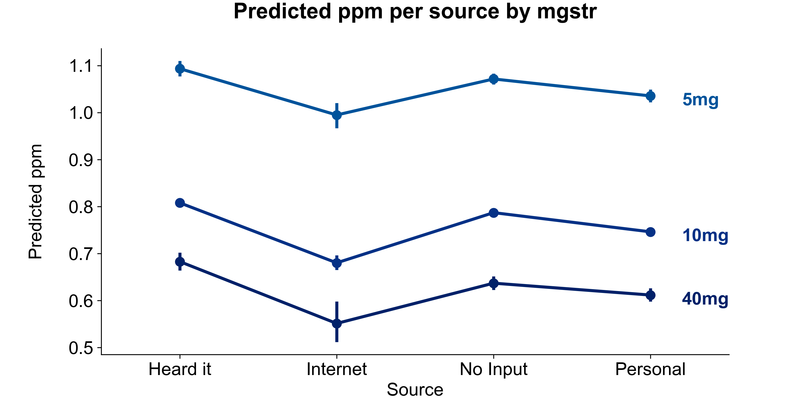

```{r setup, include=FALSE}
knitr::opts_chunk$set(
	echo = FALSE,
	message = FALSE,
	warning = FALSE
)

library(ggplot2)
library(dplyr)
library(tidyr)
library(data.table)
library(lmerTest)
library(GGally)
library(knitr)
library(xtable)
library(kableExtra)
library(stargazer)
```


# Summary

# Introduction
Prescription opioid diversion and misuse are major public health issues, and street pricing reflects medication availability, demand, and potential abuse. However, such information can be difficult to obtain, and in an age of Internet-based social networks, crowdsourcing seems to be an effective solution. Nevertheless, for our study, we use data provided by StreetRx. StreetRx is a web-based citizen reporting tool that collects real-time street price data on diverted pharmaceutical medicines. Users can anonymously report amounts they paid or heard were paid for diverted prescription drugs on the site, which is based on crowdsourcing ideas for public health surveillance. The Researched Abuse, Diversion, and Addiction-Related Surveillance System (RADARS), a surveillance system that collects product- and geographically-specific data on prescription drug abuse, misuse, and diversion, works closely with StreetRx. In November 2010, the site was launched in the United States. Over 300,000 reports of diverted medication pricing have been filed since then. Australia, Canada, France, Germany, Italy, Spain, and the United Kingdom have all joined the StreetRx family.
StreetRx provides useful information for pharmacoepidemiological research, health-policy analysis, and pharmacy-economic modeling. Therefore, we aim to analyze a multi-level model using StreetRX data to study characteristics associated to the price per mg of your medicine, allowing for potential clustering by area and examining variability in pricing by region. This study also looks at whether or not the factors provided are connected to price per milligram.

# Data
The data set used for the analysis is the subset with Methadone as an active ingredient. It contains six variables: the outcome variable `ppm`, `state`, `USA_region`, `source`, `mgstr` and `bulk_purchase`. The data set contains missing values in two variables of interest including the outcome variable [TODO: Show % missing??].

```{r echo=FALSE}
load("../Data/streetrx.RData")
df = streetrx[streetrx$api_temp == "methadone",]
vars_to_remove = c("yq_pdate", "price_date", "city", "Primary_Reason", "country", "api_temp", "form_temp")
for (var in vars_to_remove){
  df[var] = NULL
}
df$fac_mgstr = as.factor(df$mgstr)
levels(df$bulk_purchase) = c("Not Bulk", "Bulk")

na_count = round(data.frame(apply(is.na(df), 2, mean)), 3) * 100
na_count_t = transpose(na_count)
colnames(na_count_t) <- rownames(na_count)
rownames(na_count_t) <- colnames(na_count)
na_count_t$fac_mgstr <- NULL

knitr::kable(na_count_t, format="latex", booktabs=TRUE,
             caption='Missing values percentage', row.names = FALSE) %>% 
  kable_styling(latex_options=c("hold_position"))
```

The factor variable `source` has high cardinality with few cases in certain factor levels. It has been decided to group some levels to have clearer picture in exploratory data analysis. So, all internet based sources are grouped into single level named "Internet" and values such as "None", "N/A" are grouped into "No Input" category. Moreover, all cases with missing `ppm` are removed, which in turn also eliminated rows with missing `mgstr` values. The variable `mgstr` has six unique values and numeric data type. After initial inspection `mgstr` variable is transformed to a factor variable and 1mg, 2.5mg and 15mg cases are filtered as they have only one or two cases per value[TODO: table of # per category].

```{r echo=FALSE}
mgstrcount = transpose(df %>% count(mgstr))
colnames(mgstrcount) = mgstrcount[1,]
mgstrcount = cbind(data.frame(c("mgstr", "count")), mgstrcount)
colnames(mgstrcount) = NULL
colnames(mgstrcount) = mgstrcount[1,]
mgstrcount = mgstrcount[-1, ] 
rownames(mgstrcount) = NULL
knitr::kable(mgstrcount, format="latex", booktabs=TRUE, caption='mgstr frequency') %>% 
  kable_styling(latex_options=c("hold_position"))
```

The independent variable is highly skewed with a few outliers. The log transformation looks promising and it will be examined further during the modeling phase. After the check for typical methadone prices has been done, it has been decided to use the percentile method for ouliers removal with 95 percentile level as a cutoff. Overall 181 data points were removed. [TODO: plot Distribution of ppm] [TODO: How many data points were removed? 181].

```{r, echo=FALSE,out.width="70%", out.height="35%",fig.cap="ppm and ppm by state distributions",fig.show='hold',fig.align='center'}

knitr::include_graphics(c("../Presentation/Images/part1_univariate_ppm.png","../Presentation/Images/part1_ppm_per_state.png"))
``` 

During EDA it has been found out using box plots that price per milligram distributions are about the same for different source levels. But, there is a tendency for lower prices with higher dosage strength. Interestingly, different regions have different median prices per methadone milligram. The same situation holds across the states [TODO: plot from PPT + ppm per region?].

Therefore, these variables may be potential candidates for a hierarchical model. Surprisingly, there is no much price difference by `bulk_purchase` variable. The only prominent interaction that has been observed is dosage strength by states. The trends are very different e.g. in Texas prices are getting lower with higher dosage strength and getting higher in Delaware.  

# Model
To fit the hierarchical linear regression model, we start modeling using a regular linear regression by defining a null model and full model to use in a stepwise regression process in order to build a parsimonious model. The null model contains only an intercept, whereas the full model contains all relevant variables from the data set without interactions as predictor variables. We use the AIC rather than BIC because the latter is too stringent and removes most variables from the model, which makes it hard to answer our inferential questions. The resulting model violated normality assumption. To fix that we tried to log transform `ppm` variable. Unfortunately, this does not help to meet normality assumption and makes residuals even less normal than before the transformation. Afterwards, we have taken original `ppm` variable and removed outliers using 95 percentile and that helps mitigate severe violation of the normality assumption. 
Our stepwise model equals full model and contains factorized `mgstr`, `source` and `bulk_purchase` as variables. All levels of `mgstr` are significant compared to baseline - "5 mg" as well as bulk purchase significantly differs from not bulk. Only "No Input" source is not significant compared to baseline "Heard it". Having done with our foundational model we have checked potential interactions including: `source`:`fac_mgstr`, `source`:`bulk`, `fac_mgstr`:`bulk`. In order to do that we employ the ANOVA F-test to test our original stepwise model against the stepwise model plus interactions separately and find that none of them are significant.
Given that the data set contains two potentially hierachical variables `USA_region`, `state` and both of them are promising according to our EDA, we have fit three random intercept hierarchical linear regression models using all the variables from the step model including `USA_region` and `state` separately and finally, combine both grouping variables together. The lowest AIC 4756.9 has the model with two random intercepts. 

\begin{center}\begin{tabular}{lrrr}
\toprule
& AIC \\
\midrule
state     &   4760.2  \\
region &  4783.7  \\
state and region & 4756.9 \\
\bottomrule
\end{tabular}

Random Intercept Hierarchical models AIC
\end{center}

In addition, the Anova F-test has been done and adding second random intercept is significant. Thus, the final model contains `mgstr`, `source`, `bulk_purchase` and two hierarchical variables `state`, `USA_region`.

[TODO: formula]

```{r echo=FALSE, results='asis'}
# Preprocessing
df$source = as.character(df$source)
url_regex = "(http://|\\.)"
df$source[grepl(url_regex, df$source)] = "Internet"
df$source[df$source %in% c("", "N/A", "None")] = "No Input"
df$source[df$source %in% c("google", "Internet Pharmacy", "Poopy,", "Streetrx")] = "Internet"
df$source = as.factor(df$source)
df = drop_na(df, "ppm")
df = drop_na(df, "mgstr")
df = df %>% filter(mgstr %in% c(5, 10, 40))
percentile_cuttoff = quantile(df$ppm, 0.95)
df = df %>% filter(ppm <= percentile_cuttoff)

# Hierarchical models
state_only <- lmer(ppm ~ fac_mgstr + bulk_purchase + source + (1 | state), data = df)
state_and_region <- lmer(ppm ~ fac_mgstr + bulk_purchase + source + (1 | USA_region) + (1 | state), data = df)
ftest = anova(state_only, state_and_region)

cat("\\begin{center}")
xtable(ftest)
cat("\nF-Test for one random intercept vs two random intercepts models\n")
cat("\\end{center}")
```

As mentioned before, our final model satisfies all linear regression assumptions. However, fitter versus residuals plot has weird artifacts due to the fact that the data set contains only categorical variables.

[TODO: QQPlot?, fitter vs residuals?]

```{r echo=FALSE}
summary_final = summary(state_and_region)
summaryprint = data.frame(summary_final$coefficients)
summaryprint$df = NULL
confdf = confint(state_and_region)
confdf = confdf[4:length(confdf[,1]),]
summarydf = cbind(round(summaryprint,4),round(confdf,4)) #,starsdf))

colnames(summarydf) = c("Estimate","Std. Error","t value", "p value","Lower Bound","Upper Bound")
knitr::kable(summarydf, format="latex", booktabs=TRUE, caption="Fixed effects of the hierarchical linear regression model") %>% 
  kable_styling(latex_options=c("hold_position"))
```

All the fixed effects in the final model are significant except the "No Input" category of `source` variable in comparison to the baseline "Heard of". As all fixed effects coefficients are negative, we can conclude that the highest price is predicted when all fixed effects are at the baseline levels.
Random effects standard deviation for `state` variable is 0.057 and `USA_regions` is 0.0456 which are 10.6% and 8.5% accordingly of the whole variance which means that there is a lot of variation unexplained by these variables. 

```{r echo=FALSE}
ranefprint = data.frame(summary_final$varcor)
ranefprint = ranefprint[,-3]
ranefprint[is.na(ranefprint)] = ""
ranefprint[,3:4] = round(ranefprint[,3:4],4)
colnames(ranefprint) = c("Groups","Name","Variance","Std.Dev.")

knitr::kable(ranefprint, format="latex", booktabs=TRUE, caption="Varience of the random effects") %>% 
  kable_styling(latex_options=c("hold_position"))
```

Moreover, we have only one significant region which accounted for `USA_regions` variable. Price per milligram in the South tends to be higher than in different regions. There are three significant states: California, Arizona and Tennesse. 

```{r, echo=FALSE,out.width="70%", out.height="35%",fig.cap="ppm and ppm by state distributions",fig.show='hold',fig.align='center'}

knitr::include_graphics(c("../Presentation/Images/intercept_by_region.png","../Presentation/Images/intercept_by_state.png"))
``` 

{width=70%}


# Conclusion
