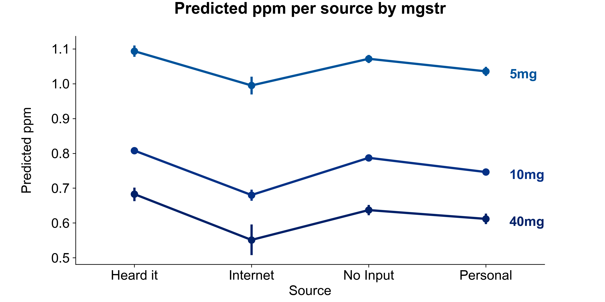

```{r setup, include=FALSE}
knitr::opts_chunk$set(
	echo = FALSE,
	message = FALSE,
	warning = FALSE
)

library(ggplot2)
library(dplyr)
library(tidyr)
library(data.table)
library(lmerTest)
library(GGally)
library(knitr)
library(xtable)
library(kableExtra)
library(stargazer)
```


# Summary
This study explores factors associated with the prices of methadone in the black market with a multi-level linear regression model. The response variable in our study is the price per milligram (ppm) variable.  In combination, the linear regression models with the stepwise regression process suggested that 'mgstr', 'source', and 'bulk_purchase' as predictor variables. `USA_regions` and `State` are suitable as hierarchical predictor variables. Our final model contains 'mgstr', 'source', and 'bulk_purchase' as fixed effects, and  `USA_regions` and `State` as random intercept variables. The fixed effects suggested that there is a tendency for lower prices with higher dosage strength. And, there is a tendency for lower prices with higher dosage strength. The hierarchical variables suggested that methadone prices could vary by region within the United States. For example, the price per milligram (ppm) in the South tends to be higher than in other regions. There are three significant states: California, Arizona, and Tennessee, in which California and Arizona seem to have the cheapest methadone, while Tennessee is paying significantly more compared to all the other states. 

# Introduction
Prescription opioid diversion and misuse are major public health issues, and street pricing reflects medication availability, demand, and potential abuse. However, such information can be challenging to obtain, and in an age of Internet-based social networks, crowdsourcing seems to be an effective solution. Nevertheless, for our study, we use data provided by StreetRx. StreetRx is a web-based citizen reporting tool that collects real-time street price data on diverted pharmaceutical medicines. Based on crowdsourcing ideas for public health surveillance, users can anonymously report drug prices they paid or heard were paid for diverted prescription drugs on the website. This study utilizes the product- and geographically-specific data on the drug Methadone from StreetRx. Methadone is an opioid class medication that helps to reduce drug withdrawal symptoms for other narcotic drugs. Unfortunately, methadone itself is also addictive. Knowing the price of methadone on the street would be crucial to preventing drug abuse, misuse, and the diversion of prescription drugs; thus, this study focuses on exploring factors that influence the price of methadone per milligram. We aim to analyze a multi-level model to study characteristics associated with the price per mg of methadone, allowing for potential clustering by area and examining variability in pricing by region. 

# Data
The data set used for the analysis is the subset with methadone as an active ingredient. It contains six variables: `ppm` as the response variable, and `state`, `USA_region`, `source`, `mgstr`, and `bulk_purchase` as the predictor variables. In addition, the data set contains missing values in two variables of interest,`mgstr` and `ppm`, in which include the outcome variable. Therefore, the exploratory data analysis begins with data cleaning in eliminating missing data values from the dataset.

```{r echo=FALSE}
load("../Data/streetrx.RData")
df = streetrx[streetrx$api_temp == "methadone",]
vars_to_remove = c("yq_pdate", "price_date", "city", "Primary_Reason", "country", "api_temp", "form_temp")
for (var in vars_to_remove){
  df[var] = NULL
}
df$fac_mgstr = as.factor(df$mgstr)
levels(df$bulk_purchase) = c("Not Bulk", "Bulk")

na_count = round(data.frame(apply(is.na(df), 2, mean)), 3) * 100
na_count_t = transpose(na_count)
colnames(na_count_t) <- rownames(na_count)
rownames(na_count_t) <- colnames(na_count)
na_count_t$fac_mgstr <- NULL

knitr::kable(na_count_t, format="latex", booktabs=TRUE,
             caption='Missing values percentage', row.names = FALSE) %>% 
  kable_styling(latex_options=c("hold_position"))
```
The factor variable `source` has high cardinality with few cases in certain factor levels. Therefore, we decided to group some levels to have a clearer picture in the exploratory data analysis. All internet-based sources are grouped into a single-level named "Internet," and values such as "None" and "N/A" are grouped into the "No Input" category. Moreover, all entries with missing `ppm` are removed, which also eliminated rows with missing `mgstr` values. The variable `mgstr` has six unique values and numeric data types. After an initial inspection,  `mgstr` variable is transformed to a factor variable, and 1mg, 2.5mg, and 15mg cases are filtered as they have only one or two entries per value.

```{r echo=FALSE}
df$source = as.character(df$source)
url_regex = "(http://|\\.)"
df$source[grepl(url_regex, df$source)] = "Internet"
df$source[df$source %in% c("", "N/A", "None")] = "No Input"
df$source[df$source %in% c("google", "Internet Pharmacy", "Poopy,", "Streetrx")] = "Internet"
df$source = as.factor(df$source)
df = drop_na(df, "ppm")
df = drop_na(df, "mgstr")

mgstrcount = transpose(df %>% count(mgstr))
colnames(mgstrcount) = mgstrcount[1,]
mgstrcount = cbind(data.frame(c("mgstr", "count")), mgstrcount)
colnames(mgstrcount) = NULL
colnames(mgstrcount) = mgstrcount[1,]
mgstrcount = mgstrcount[-1, ] 
rownames(mgstrcount) = NULL
knitr::kable(mgstrcount, format="latex", booktabs=TRUE, caption='mgstr frequency') %>% 
  kable_styling(latex_options=c("hold_position"))
```

The distribution of the response variable `ppm` is highly right-skewed and contains a few outliers. The log transformation of `ppm` helps to reduce the skewness in the distribution. Thus, we would like to examine further the performance of transformed `ppm` in the modeling phase. Another potential factor that could influence the final model is the outliers within`ppm`. According to the research article by H.Surat, the median price for methadone is $1.00; our dataset contains several outliers that are 40 times greater than the median, which is concerning (H.Suratt et al. 2013). By referencing the outliers removal method presented in the article combined with our research on the usual costs of methadone, we use the percentile method for outliers removal with a 95 percentile level as a cutoff. Overall, 181 data points were removed from the dataset.

```{r, echo=FALSE,out.width="70%", out.height="35%",fig.cap="ppm and ppm by state distributions",fig.show='hold',fig.align='center'}

knitr::include_graphics(c("../Presentation/Images/part1_univariate_ppm.png","../Presentation/Images/part1_ppm_per_state.png"))
``` 

During EDA it has been found out using box plots that price per milligram distributions are about the same for different source levels. But, there is a tendency for lower prices with higher dosage strength. Interestingly, different regions have different median prices per methadone milligram. The same situation holds across the states which can be seen in the plot above which shows only a subset of states. Therefore, these variables may be potential candidates for a hierarchical model and as different states contain different amount of observations a hierarchical model may be better choice than multivariate linear regression with `state` and `USA_regions` as categorical variables.
Surprisingly, there is no much price difference by `bulk_purchase` variable. As for the interaction observed between dosage strength and state, except for Texas and Delaware, the trend of `ppm` by dosage strength remains consistent across states. Therefore, for modeling, we decide to explore varying intercepts as opposed to random slopes.

# Model
To fit the hierarchical linear regression model, we start modeling using a regular linear regression by defining a null model and full model to use in a stepwise regression process in order to build a parsimonious model. The null model contains only an intercept, whereas the full model contains all relevant variables from the data set without interactions as predictor variables. We use the AIC rather than BIC because the latter is too stringent and removes most variables from the model, which makes it hard to answer our inferential questions. The resulting model violated normality assumption. To fix that we tried to log transform `ppm` variable. Unfortunately, this does not help to meet normality assumption and makes residuals even less normal than before the transformation. Afterwards, we have taken original `ppm` variable and removed outliers using 95 percentile and that helps mitigate severe violation of the normality assumption. 
Our stepwise model equals full model and contains factorized `mgstr`, `source` and `bulk_purchase` as variables. All levels of `mgstr` are significant compared to baseline - "5 mg" as well as bulk purchase significantly differs from not bulk. Only "No Input" source is not significant compared to baseline "Heard it". Having done with our foundational model we have checked potential interactions including: `source`:`fac_mgstr`, `source`:`bulk`, `fac_mgstr`:`bulk`. In order to do that we employ the ANOVA F-test to test our original stepwise model against the stepwise model plus interactions separately and find that none of them are significant.
Given that the data set contains two potentially hierachical variables `USA_region`, `state` and both of them are promising according to our EDA, we have fit three random intercept hierarchical linear regression models using all the variables from the step model including `USA_region` and `state` separately and finally, combine both grouping variables together. The model with two random intercepts has the lowest AIC score of 4756.9 (differs from values shown in table below due to ML/REML refitting). 

\begin{center}\begin{tabular}{lrrr}
\toprule
& AIC \\
\midrule
state     &   4760.2  \\
region &  4783.7  \\
state and region & 4756.9 \\
\bottomrule
\end{tabular}

Random Intercept Hierarchical models AIC
\end{center}

In addition, the Anova F-test has been done and adding second random intercept is significant. Thus, the final model contains `mgstr`, `source`, `bulk_purchase` and two hierarchical variables `state`, `USA_region`.

$$ {\rm ppm}_i = (\beta_{0} + \gamma_{0j} + \psi_{0k}) + \beta_1\cdot{\rm mgstr}_{ijk} + \beta_2\cdot{\rm bulk\_purchase}_{ijk}+\beta_3\cdot{\rm source}_{ijk} + \varepsilon_{ijk} \\$$
$$ \varepsilon_{ijk} \sim \mathcal{N}(0, \sigma^2), i=1, ..., n; j=1,...,J $$
$$ \gamma_{0j} \sim \mathcal{N}(0, \tau_{0}^2), i=1, ..., n; j=1,...,J $$
$$ \psi_{0k} \sim \mathcal{N}(0, \varsigma_{0}^2), i=1, ..., n; k=1,...,K $$

```{r echo=FALSE, results='asis'}
# Preprocessing

df = df %>% filter(mgstr %in% c(5, 10, 40))
percentile_cuttoff = quantile(df$ppm, 0.95)
df = df %>% filter(ppm <= percentile_cuttoff)

# Hierarchical models
state_only <- lmer(ppm ~ fac_mgstr + bulk_purchase + source + (1 | state), data = df)
state_and_region <- lmer(ppm ~ fac_mgstr + bulk_purchase + source + (1 | USA_region) + (1 | state), data = df)
ftest = anova(state_only, state_and_region)

cat("\\begin{center}")
xtable(ftest)
cat("\nF-Test for one random intercept vs two random intercepts models\n")
cat("\\end{center}")
```

As mentioned before, our final model satisfies all linear regression assumptions. However, fitter versus residuals plot has weird artifacts due to the fact that the data set contains only categorical variables.

```{r, echo=FALSE,out.width="33%", out.height="30%",fig.cap="Model assessment plots",fig.show='hold'}

knitr::include_graphics(c("../Presentation/Images/lm_qqplot_residuals.png","../Presentation/Images/lm_resid_fitted.png", "../Presentation/Images/lm_cooks(in r).png"))
``` 

```{r echo=FALSE}
summary_final = summary(state_and_region)
summaryprint = data.frame(summary_final$coefficients)
summaryprint$df = NULL
confdf = confint(state_and_region)
confdf = confdf[4:length(confdf[,1]),]
summarydf = cbind(round(summaryprint,4),round(confdf,4)) #,starsdf))

colnames(summarydf) = c("Estimate","Std. Error","t value", "p value","Lower Bound","Upper Bound")
knitr::kable(summarydf, format="latex", booktabs=TRUE, caption="Fixed effects of the hierarchical linear regression model") %>% 
  kable_styling(latex_options=c("hold_position"))
```

All the fixed effects in the final model are significant except the "No Input" category of `source` variable in comparison to the baseline "Heard of". As all fixed effects coefficients are negative, we can conclude that the highest price is predicted when all fixed effects are at the baseline levels.
Random effects standard deviation for `state` variable is 0.057 and `USA_regions` is 0.0456 which are 10.6% and 8.5% accordingly of the whole variance which means that there is a lot of variation unexplained by these variables. 

```{r echo=FALSE}
ranefprint = data.frame(summary_final$varcor)
ranefprint = ranefprint[,-3]
ranefprint[is.na(ranefprint)] = ""
ranefprint[,3:4] = round(ranefprint[,3:4],4)
colnames(ranefprint) = c("Groups","Name","Variance","Std.Dev.")

knitr::kable(ranefprint, format="latex", booktabs=TRUE, caption="Varience of the random effects") %>% 
  kable_styling(latex_options=c("hold_position"))
```

Moreover, we have only one significant region which accounted for `USA_regions` variable. Price per milligram in the South tends to be higher than in different regions. There are three significant states: California, Arizona and Tennesse. 

```{r, echo=FALSE,out.width="70%", out.height="30%",fig.cap="Random intercept by state and region", fig.show='hold', fig.align='center'}

knitr::include_graphics(c("../Presentation/Images/intercept_by_region.png","../Presentation/Images/intercept_by_state.png"))
```

As the final model contains lots of variables it is easier to understand the model with prediction plot which incorporates all the variables except `bulk_purchase` which will only move the graph along the y-axis.

```{r, echo=FALSE,out.width="100%", out.height="20%",fig.cap="Prediction plot", fig.show='hold', fig.align='center'}


``` 


# Conclusion

In this study, we studied factors associated with the price of methadone in the United States black market. We used a multi-level hierarchical model with random intercepts to analyze how product and geographical data could affect the price per milligram of methadone. The model used both `USA_regions` and `state` as hierarchical variables, and 'mgstr', 'source', and 'bulk_purchase' as fixed effects. Geographically, as the model suggests, methadone is the most expensive in the southern regions of the United States. Similar to this finding, the other hierarchical variable states confirmed this trend because the southern state Tennessee has the significantly most expensive methadone compared to the other states. On the other hand, California and Arizona have the least costly methadone nationwide.

TBD (I'm so tired I need to sleep, see ya tmr)

\newpage

# Citations
1. H.Suratt et al. 2013. Street prices of prescription opioids diverted to the illicit market: data from a national surveillance program. https://doi.org/10.1016/j.jpain.2013.01.455
