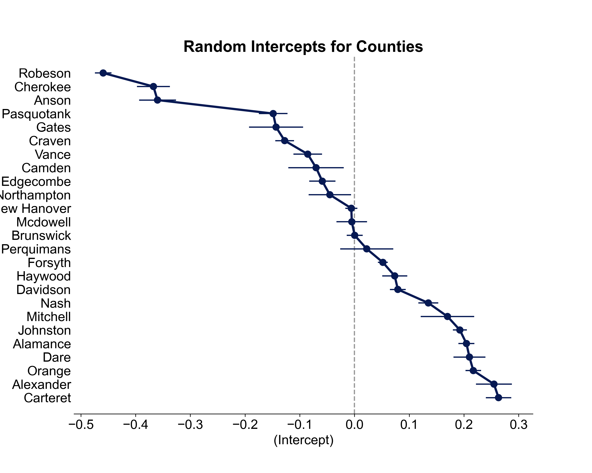

```{r setup, include=FALSE}
knitr::opts_chunk$set(
	echo = FALSE,
	message = FALSE,
	warning = FALSE
)


library(purrr)
library(arm)
library(lattice)
library(ggplot2)
library(dplyr)
library(tidyr)
library(data.table)
library(lme4)
library(GGally)
library(knitr)
library(xtable)
library(kableExtra)
library(stargazer)
```

# Summary

This study investigates the voting behavior of different demographic groups in the 2020 general election in North Carolina. We utilize the hierarchical logistic regression model to examine if the overall likelihood of voting in 2020 differs by county, as well as if the turnout rates differ by sex or age group for each political party. While the model suggested no significant difference in turnout rates between genders, voter turnout rates could differ by race and ethnicity. Among all races, holding all else constant, black voters tend to have a lower likelihood to vote compared to Asian voters. Ethnicity-wise, Hispanic voters tend to have a lower likelihood to vote compared to Non-Hispanic voters. The voting behavior by age and gender also differs between the citizen's party affiliation. Examining age in combination with party affiliation, we observe that, while the older population (age over 66) are generally more likely to vote, young females (18-25 years old) affiliated with the Green party are associated with higher turnout rates than female peers in other parties. Examining sex in conjunction with party affiliation, we observe that young males affiliated with the Green party or those of undesignated gender in the Libertarian Party both tend to be associated with higher turnout rates than young females affiliated with the Constitutional party, which is our baseline. Lastly, the model indicated that there are differences in voting likelihood between counties. For instance, Carteret, Alexander, and Orange county have the highest turnout rates, while Robeson, Cherokee, and Anson have the lowest turnout rates.

# Introduction
The North Carolina State Board of Elections ("NCSBE") oversees election administration as well as campaign finance disclosure and compliance. They give voter registration and turnout information online, among other things, via the ncsbe.gov website. Using the North Carolina ("NC") voter files for the general elections in November 2020, we attempt to identify/estimate the voting behavior of various demographic groups in the 2020 elections in North Carolina. We also employ a hierarchical model to capture the geographical differences of the voting turnout by county. In this study, we take a sample of 25 NC counties to analyze. In addition, we aim to answer the following questions of interest: what was the difference in turnout rates between men and women for each party affiliation as well as what was the difference in turnout rates between age groups for each party affiliation. 

# Data

```{r echo=FALSE}
voters = read.csv("../Data/voter_stats_20201103.txt", sep="\t")
unique_counties = unique(voters$county_desc)
set.seed(42); used_counties = sample(unique_counties, size=25)
voters = voters %>% filter(county_desc %in% used_counties)

history = read.csv("../Data/history_stats_20201103.txt", sep="\t") %>%
  filter(county_desc %in% used_counties)

vars_to_remove = c("stats_type", "election_date", "update_date")
for (var in vars_to_remove){
  voters[var] = NULL
  history[var] = NULL
}

# Aggregate the history data set 
agg_by = list(history$county_desc, history$age, history$voted_party_cd, history$race_code, history$ethnic_code, history$sex_code)
history_agg <- aggregate(history$total_voters, agg_by, sum)
colnames(history_agg) = c("county_desc", "age", "voted_party_cd", "race_code", "ethnic_code", "sex_code", "total_voters")

# Aggregate the voters data set
agg_by = list(voters$county_desc, voters$age, voters$party_cd, voters$race_code, voters$ethnic_code, voters$sex_code)
voters_agg <- aggregate(voters$total_voters, agg_by, sum)
colnames(voters_agg) = c("county_desc", "age", "party_cd", "race_code", "ethnic_code", "sex_code", "total_voters")

colnames(history_agg)[3] = "party_cd"
df = left_join(voters_agg, history_agg, suffix=c(".registered", ".actual"), by=c("county_desc", "age", "party_cd", "race_code", "ethnic_code", "sex_code"))

# df$total_voters.actual = replace_na(df$total_voters.actual, 0)
df = df %>% drop_na(total_voters.actual)

deltas = df$total_voters.actual - df$total_voters.registered
df[deltas > 0, "total_voters.actual"] = df[deltas > 0, "total_voters.actual"] - deltas[deltas > 0]

# Fix dtypes
factor_vars = c("county_desc", "party_cd", "race_code", "ethnic_code", "sex_code", "age")
for (fvar in factor_vars){
  df[,fvar] = as.factor(df[,fvar])
}

# Voter Turnout
df$turnout = df$total_voters.actual / df$total_voters.registered
```

Two data sets are available for this analysis. The first one, "Voters", contains the number of registered voters (`total_voters.registered`) with fourteen additional variables and 592,265 rows. The second one, "History", contains the number of actual votes (`total_voters.actual`) with eleven other variables and 928,532 rows. We use only a subset of these data sets for our purposes. We have randomly sampled 25 counties and used them as a filter. The counties used in the analysis are: Cherokee, Dare, Alexander, Pasquotank, Camden, Mitchell, Anson, Vance, Carteret, Perquimans, Edgecombe, Brunswick, New Hanover, Robeson, Mcdowell, Nash, Davidson, Forsyth, Johnston, Northampton, Craven, Haywood, Gates, Alamance, Orange. After filtering, the resulting data sets have 130,709 and 205,303 observations for "Voters" and "History" respectively. Variables `stats_type`, `election_date`, `update_date` are deleted immediately as they are not of interest.  

In order to merge the data from two tables, we have performed aggregations of "History" and "Voters" data sets separately to join the tables correctly. Grouping variables used for the aggregations are: `county_desc`, `age`, `party_cd` (`voted_party_cd`), `race_code`, `ethnic_code`, `sex_code`. The variables `total_voters.actual` and `total_voters.registered` are summed across these groups. Post aggregation, the "History" and "Voters" data sets have 11,374 and 12,935 rows respectively. Post aggregation and after renaming the `voted_party_cd` variable from the "History" data set to `party_cd`, we left join the "History" (right) to the "Voters" (left) data set. The keys for the left join are the same as the grouping variables above and, post join, we now have 12,935 rows. The join induces a large number of N/A values for the `total_voters.actual` column, indicating around 1,000 demographic subgroups registered to vote, but we do not have data on the actual votes. The join also induces ten observations with more actual votes than registered. We decide to lower the amount of actual votes for these observations. In addition, when comparing the number of missing actual votes in the `total_voters.actual` column to the number of excess actual votes, we see that they are highly dissimilar. Thus, we decide to drop all rows with missing values in `total_voters.actual`, which reduces the merged data set to 11,374 observations.

*TODO: address precinct_issues*

As a part of our EDA, we disaggregate the aggregated actual voting variable to a binary variable with duplicated rows. Conditional probability tables reveal some interesting associations. The voting probability varies for different age groups. Older people tend to vote with higher probability than younger people. The youngest age group "18-25" has a 58.3% probability of voting, whereas the oldest group "Over 66" has a 84.2% probability. Moreover, probability of voting is different across ethnic groups. The Hispanic group has a lower voting probability (58.3%) than Non-Hispanic (76.5%) or Undesignated (73.7%). Voting rates also varies across races: the "Other" group has the lowest probability of voting at 58.9%, whereas the "White" group has a 78.6% probability. Additionally, noticeable variation of conditional probabilities can also be observed across party affiliations: Republicans have a 82.1% and Libertarians a 65.7% probability of voting. The most interesting interactions are `party_cd`:`sex_code` and `party_cd`:`age`. The relationship between turnout rate and sex is reversed for the Libertarian party and the Unaffiliated group. It is higher for female in Unaffiliated and higher for male in Libertarian party. Green party has higher turnout rate for younger people in 18-25 years category than any other parties have. We will examine these interactions further during the modeling process.

Finally, the variable `county_desc` may be a hierarchical one as turnout rate varies and the number of observation substantially differs across different counties. Thus, rather than using this variable as categorical one in our logistic regression, we should try using it as a random intercept. While we do observe minor differences in trends of average turnout by `sex_code`, `age` and `party_cd` across counties, most of these differences occur in counties with relatively few data points. For those subgroups with many data points, the magnitudes of these differences are not large enough for us to conclusively also include random slopes for `county_desc`. 

# Model
```{r echo=FALSE}
load("../model4.Rdata")


```

In order to answer our inferential questions, we use a hierarchical logistic regression model. Before fitting the hierarchical model, we first fit a regular logistic regression as our baseline model using the AIC stepwise approach for variable selection. Our Null model contains the intercept only and our Full model includes all non-location predictor variables: `party_cd`, `race_code`, `ethnic_code`, `sex_code`, `age`. The resulting stepwise model retains all the variables. The only insignificant categories in the stepwise model are the "Democrats", "Republicans" levels of the `party_cd` variable in comparison to the baseline "Constitution party" which gives us confidence to proceed further. As a next step, we include the`sex_code`:`party_cd` and `age`:`party_cd` interactions to our stepwise model in order to address our questions of interest. Finally, we add `county_desc` as a hierarchical level to our model. However, we experience several model convergence issues while fitting a hierarchical model due to having too many parameters to estimate for our given set of observations. Ultimately, improving our data pre-processing approach, such as aggregating not only the "History" data set, but also "Voters" as well as aggregating out both `vtd_abbrv` and `precinct_abbrv` in the two data sets helped our final model converge.

Our final model contains `party_cd`, `race_code`, `ethnic_code`, `sex_code`, `age` variables and `sex_code`:`party_cd` ,`age`:`party_cd` interactions. The hierarchical level uses `county_desc` variable for creating random intercepts. 

$$\\y_{ij}|x_{ij} \thicksim Bernoulli(turnout_{ij})$$

\begin{equation*}
  \begin{aligned}
\log(\frac{turnout_i}{1-turnout_i}) = (\beta_{0} + \gamma_{0j}) + \beta_1\cdot{\rm party\_cd}_{ij} + \beta_2\cdot{\rm race\_code}_{ij}+\beta_3\cdot{\rm ethnic\_code}_{ij} \\
+ \beta_4\cdot{\rm sex\_code}_{ij} + \beta_4\cdot{\rm age}_{ij} + \beta5\cdot{\rm sex\_code:party\_cd}_{ij} + \beta6\cdot{\rm age:party\_cd}_{ij}
\end{aligned}
\end{equation*}

$$\gamma_{0j} \sim \mathcal{N}(0, \sigma_{0}^2), i=1, ..., n; j=1,...,J $$
All categories in `race_code` variable are significant and highly dispersed. Race code "B" (Black) is associated with a decrease in the log odds ratio by 0.1869, which corresponds to a 0.83 ($\exp(-0.1869)$) multiplicative effect or 17% decrease in odds ratio in comparison to base level "A" (Asian). On the other hand, race code "U" (Undesignated) is associated with an increase in the log odds ratio by 0.2467 or by 1.28 ($\exp(0.2467)$) multiplicative effect. The variable `ethnic_code` has all significant categories too. Being Non-Hispanic is associated with increasing log odds by 0.42 (1.52 in odds ratio) in comparison to Hispanic ethnic group and being part of Undesignated ethnic group is associated with increasing log odds ratio by 0.30 (1.35 in odds ratio).

There is no significant difference by `sex_code` variable in comparison with the baseline level without accounting for party affiliations. So, we can not conclude that being male, female or of undesignated gender is associated with higher or lower turnout rates for those affiliated with the baseline Constitutional party and baseline age 18-25. However, females aged 18-25 who are part of the Liberal party are associated with a decrease in log odds ratio by the factor of 0.6728 (0.51 odds ratio) in comparison with the same group affiliated with the Constitutional party. We have two significant levels of party by sex interaction. Being male, aged 18-25, and a member of Green party is associated with an increase in log odds ratio by 0.786 (2.19 odds ratio) in comparison to being a female member of Constitutional party of the same age group, which is our baseline. The second significant level is a Libertarian party member with undesignated sex category. This level is associated with an increase in log odds ratio 0.74 (2.10 odds ratio) in comparison to the same baseline. The trends of these interactions can be better visualized by the prediction plots below (note that the two plots only show trends for two predictors at a time so the plotted predictions are not conditioned on all variables).

```{r, echo=FALSE,out.width="105%", out.height="22%",fig.cap="Turnout prediction plots", fig.show='hold', fig.align='center'}

knitr::include_graphics("../Presentation/Images/part2_turnout_predplot_2in1.png")
``` 

From the dotplot below, we can conclude that only four counties have non-significant random intercept. Counties such as Carteret and Alexander are associated with an increase in log odds ratios. On the other hand, counties such as Robeson and Cherokee are associated with a decreased log odds ratio. In other words, voters from Carteret county tend to have higher turnout and voters from Robeson have lower turnout. Overall, the model confirmed that the odds of voting indeed differ by county. 

```{r, echo=FALSE,out.width="75%", out.height="22%",fig.cap="Dotplot of random intercepts for counties", fig.show='hold', fig.align='center'}


``` 


# Conclusion
In this study, we investigated how different groups in North Carolina voted in the 2020 general elections for a sample of 25 counties. We used hierarchical logistic regression to model whether different demographic groups cast their votes in the election. Our final model contains `party_cd`, `race_code`, `ethnic_code`, `sex_code`, `age` variables and `sex_code` and `party_cd` interaction, `age` and `party_cd` interaction as fixed effects, and `county_desc` as the hierarchical variable with random intercepts. 
*TODO: double check numbers*

According to our model, different demographic subgroups, such as ethnic and race groups, have significantly different turnout rates. For instance, everything else held constant, Black citizens are 17% less likely to vote in comparison to Asians. Non-Hispanic turnout rates also tend to be 52% higher in comparison to Hispanic voters. On the other hand, the model suggested no significant difference in how votes differ by gender unless we also consider the party affiliation. If we look at how sex and party affiliation interact, we can observe a significant effect. For example, young males of the Green party or people of undesignated gender of the Libertarian Party both tend to have higher turnout rates than young females of the Constitutional party, which is the baseline. Moreover, the model showed that differences in turnout rate by age group for different party affiliations are also significant. For the Green party, young female citizens (18-25 years old) have a higher turnout than their female peers in other parties, though overall, older people are generally more likely to vote. We used a hierarchical model to analyze the turnout rates between the different counties in North Carolina. Among the 25 sampled counties, Anson, Cherokee, and Robeson have the lowest turnouts, and Carteret, Alexander, and Orange have the highest turnouts. This is also an indication that the odds of voting could indeed differ by counties. The difference in turnout rates could be explained by other per-county characteristics, which is a topic worth examining in future research. 

There are multiple limitations of the data set and the analysis. This study only considered a random sample of 25 counties in North Carolina, thus the conclusions do not necessarily generalize to the entire state.
Another limitation we have to acknowledge is that we manually modified the voter registration and voter turnout data to account for subgroups where the number of people who voted exceeds the registered number of voters. This methodology could be different had we used data on the entire state of NC. In addition to this, the two data sets on registered and actual voters have been collected from two different sources, so there is no guarantee for identical variable definitions. While modeling, the hierarchical model encountered convergence issues when there were too many parameters in the model. This limited us from fully exploring the space of all possible models, such as a random slope by county model. In the future, this analysis could be repeated for all counties in NC or other states. 
